### 介绍

Github地址：https://github.com/leechenxiang/fjyy-admin
FJYY-Admin 极简后台管理系统，前端基于Vue+ElementUI，无需nodejs，无需npm，对后端开发人员极其友好~
本框架基于`Vue` + `ElementUI`，链接地址为：https://element.eleme.cn/

使用与解说视频见bilibili：

### 说明
* 本框架不对前端有极高的代码规范，整体代码风格写的舒服看的舒服，结构雅观即可。
* 本框架对前端性能没有太高的要求，以业务功能实现为主。
* 本框架不需要安装前置依赖环境，不需要nodejs与npm，解放后端开发人员对前端环境的过度依赖。导入使用js的方式与html页面直接引入相同。
* 本框架非常适用于后端开发人员。

### 运行前端项目
打开VSCode，安装插件`Live Server`，选中页面右键运行`Open With Live Server`

### 使用步骤1：前端项目目录结构
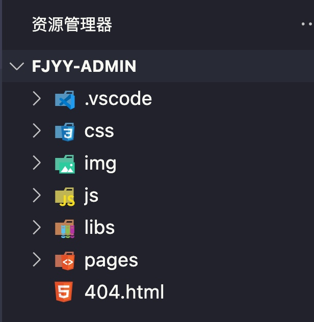
* `.vscode`：不用管
* `css`：样式文件
* `img`：图片资源
* `js`：脚本文件，api调用脚本，通用工具类等
    * `apis`：api文件目录
    * `app.js`：全局工具类
    * `cookieUtils.js`：会话管理工具
    * `request.js`：http请求封装工具
* `libs`：第三方js库、工具库，现成的已经封装好的
* `pages`：自己的页面，可以定义更多模块
* `404.html`：错误页面

### 使用步骤2：页面路由 adminrouter.js
`menuList` 支持一级和二级菜单
* title：菜单标题
* path：页面路由（路径）
* index：唯一索引标识
* icon：菜单图标
* children：子级菜单列表

`routes` 定义路由与页面关系，指定path将会路由到哪个页面
* path：与`menuList`中的path对应
* component：组件，指的是具体的那个vue页面，此处使用`httpVueLoader`进行加载
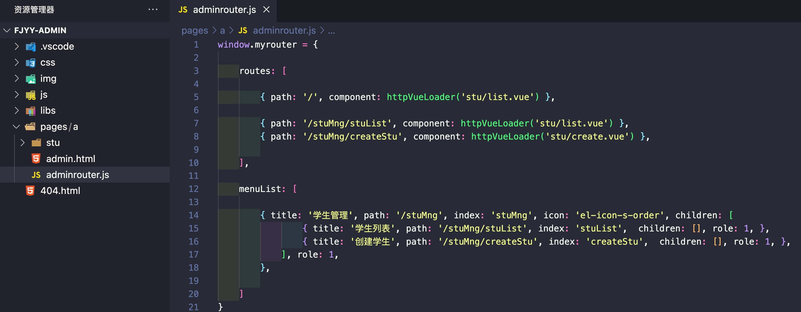

### 使用步骤3：修改后端api的server地址
`request.js`中的后台调用地址根据实际情况修改。
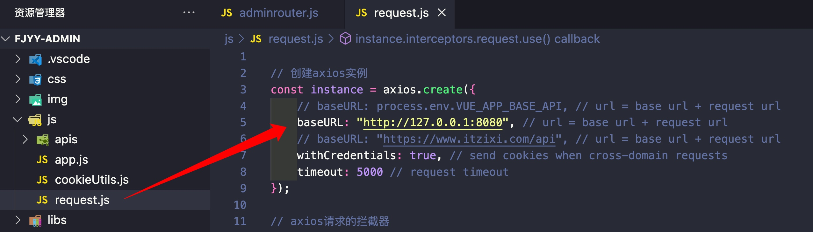

### 使用步骤4：创建接口api调用
每个模块都需要有对应的api脚本来对应，通过`window.xxxApi`来定义全局。并且在`admin.html`中加载该api脚本。如此便可以在vue页面中直接调用该api进行后端的http请求。
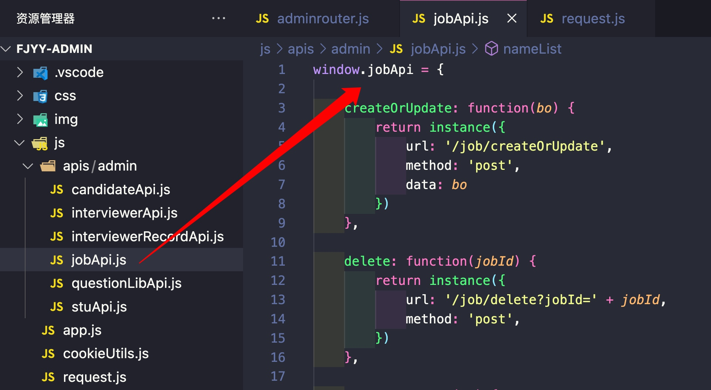

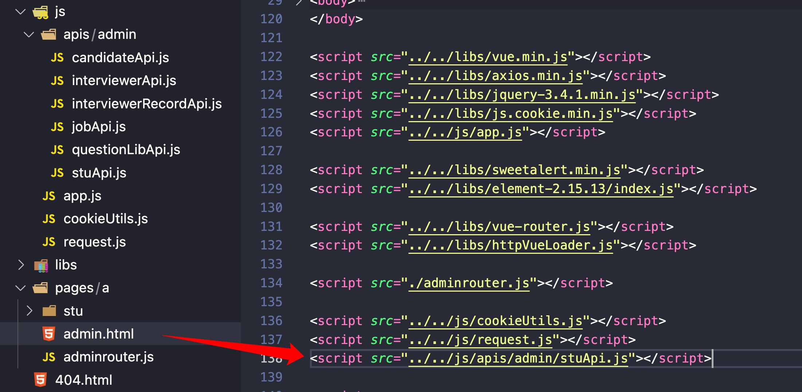

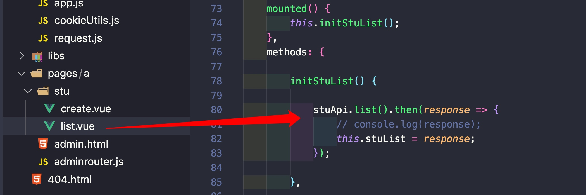

### 使用步骤6：跨域问题解决
如果遇到跨域问题，请自行修改前端的地址和端口即可。
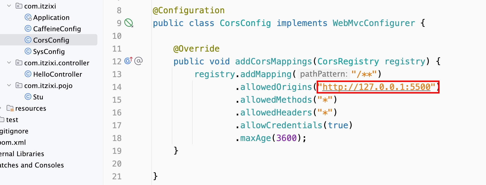

### 基本操作1：数据库说明
没有集成数据库，后台数据写死在本地缓存中。重启后台数据恢复缺省。
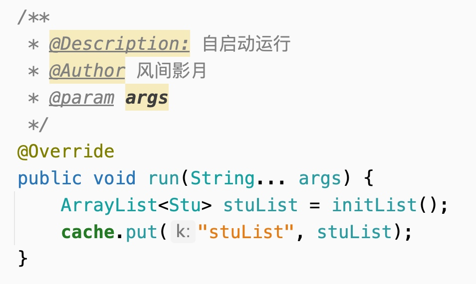

### 基本操作2：增&改
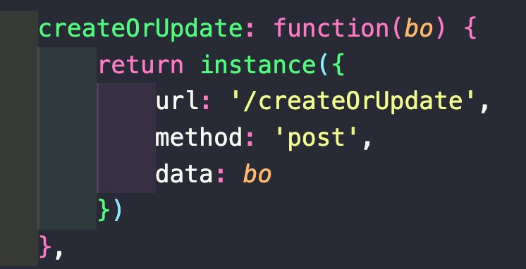

### 基本操作3：删
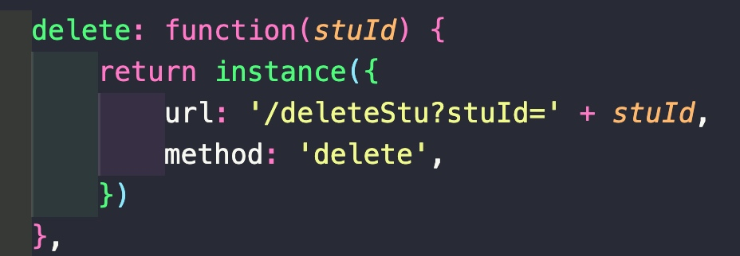

### 基本操作4：查
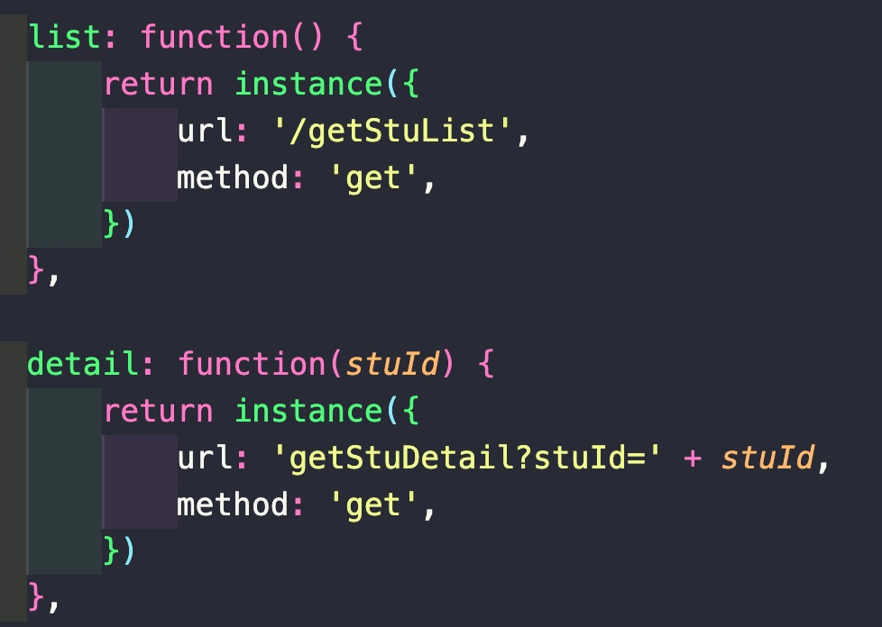

### Github链接地址
Github链接地址会放在评论区，如果没有看到可以私信，我会一一回复。

关注抖音：

关注公众号：

微信技术交流（验证：来自github）：

### License

This project is licensed under the Apache License - see the [LICENSE](./LICENSE) file for details.